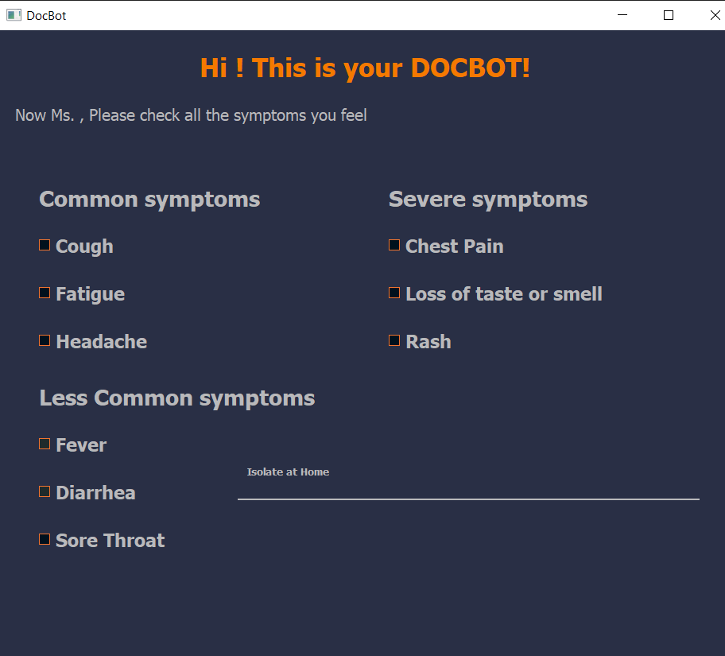

# SBE 404A - Networking Socket Project

## Medical Chat Bot - DOCBOT

**Team 2**

**Submitted to: Dr. Eman Marzban and Eng. Eman Ibrahim**

Submitted by:

|              Name              | Section | B.N. |
|:------------------------------:|:-------:|:----:|
|   Esraa Mohamed Saeed   |    1    |   10  |
|   Alaa Tarek Samir   |    1    |  12  |
| Amira Gamal Mohamed  |    1    |  15  |
|   Dalia Lotfy AbdelHay   |    1    |   31  |
|   Fatma Hussein Wageh   |    2    |  8  |
| Mariam Mohamed Osama |    2    |  26  |

Video: [Link Here](//link)

//security
//test case
//timeout message

**The programming language is python**

### Libraries in python,Apps to be downloaded
- socket (*python library*)
- threading (*python library*)
- mysql (*python library*)
- PyQt5 (*python library*)
- Ampps (*app*)

### How to run 

1. Open Ampps *to connect to the database*.

2. Open the terminal and write **Python the path of folder of the project for server file** like **"Python Desktop/Client_Server_Chatbot/server.py"** *to run the server*.

3. Open the terminal and write **Python the path of folder of the project for client file** like **"Python Desktop/Client_Server_Chatbot/client.py"** *to run the client*.

4. you can repeat step **3** for multiple clients.

5. The Gui will appear and then enter the patient information.

6. submit them to be saved in database.

7. you can check the data which is added by opening **http://localhost/phpmyadmin/server_sql.php** in google chrome.

8. Then 3 lists will appear with different symptoms, choose the symptoms you feel and submit.

9. You will get a message with best decision for you.

10. security//

**Note**
Yoy have 20 seconds to enter your data or you will have message that server is disconnected and you will leave the app.

### Project Idea

- In this project we built a "Medical Chat Bot"(DOCBOT).The application determines the severity of the symptoms of the Corona virus on the patient, and on the basis of this determines whether to go to the doctor immediately, to isolate at home or to rest at home. 

- We implement the GUI by `PyQt5`.

- GUI

- We built a server using `socket` library in Python that allowed us to generate communication with the clients(patients) using TCP/IP connection. The GUI and the server handle the connections properly.

- Server activated

- Client activated

- Each patient enters his personal data and it is saved in `mySQL` database. Then he will highlight the symptoms which he suffers from. Finally when he submits them, the message will appear to have the true decision of his case.This process depends on the number of symptoms that each patient has and which class they follow (*Most Common*,*Less Common*,*Severe*).
  
- Database
  

- The patient has limited time `timeout` to enter his personal data which arround 20 sec.Then the server closes the connection and the message box will appear to tell him that the connection was closed.
  
- TimeOut_Server

- TimeOut_Client messagebox

- Multiple clients can access to the server, each client has its own thread `threading`(connection) and it's totally independent of the other clients'connections to the server.

- Multi clients
  

- Number of connections in server

- security....

### Testing

1. Rest at Home

2. Isolate at Home

3. SEE A DOCTOR IMMEDIATELY!!!!!

